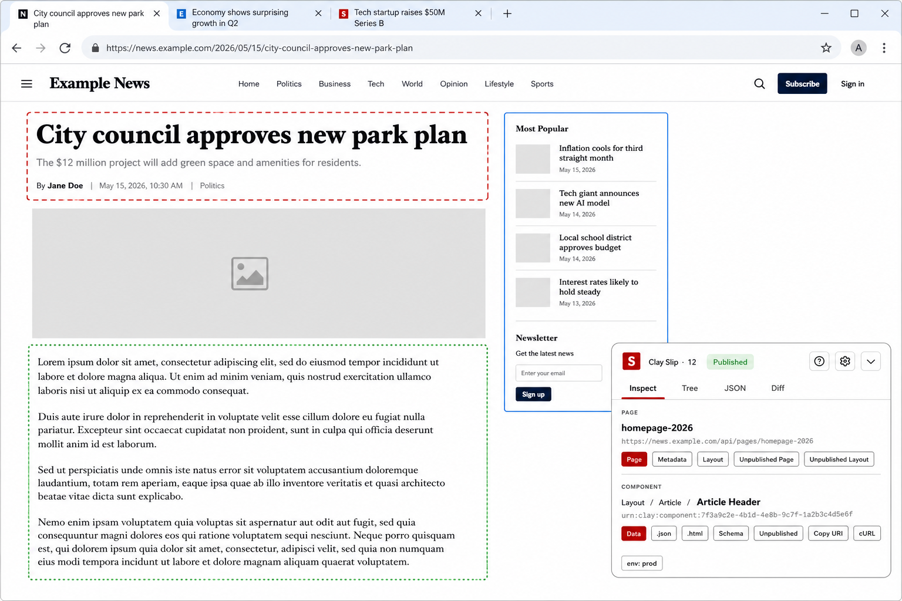
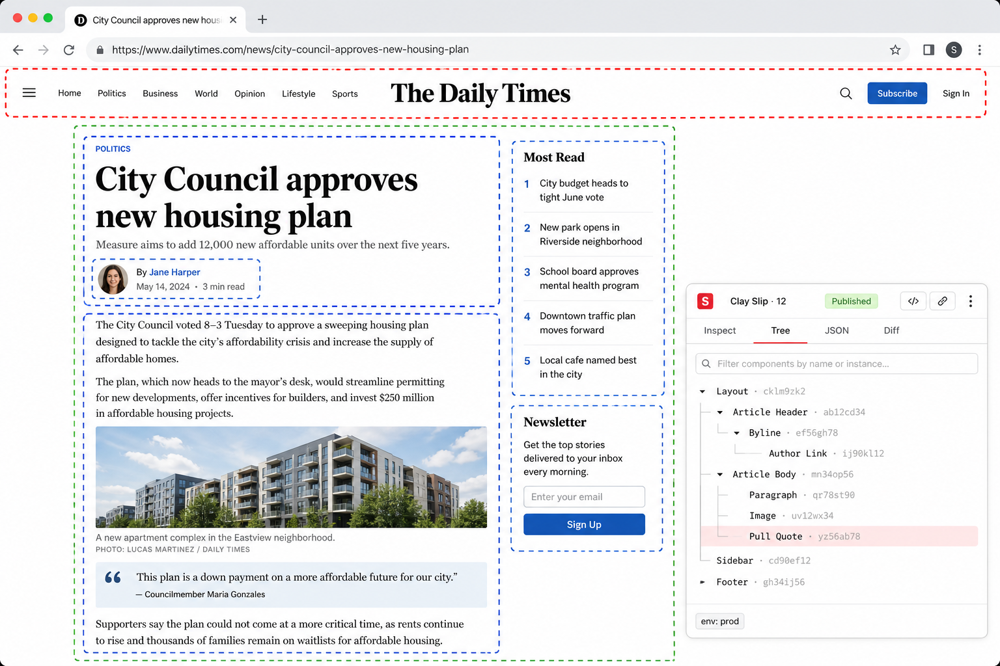
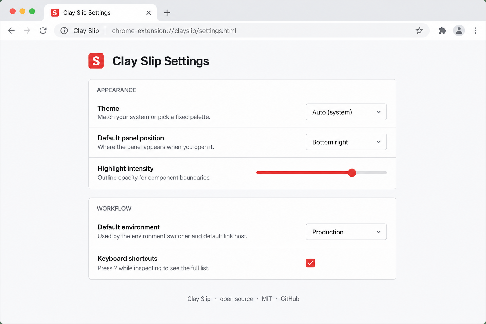

# Clay Slip

> A modern Chrome extension for exploring [Clay](https://github.com/clay) CMS pages.

Clay annotates rendered HTML with `data-uri` attributes on every component, page, and layout. Clay Slip reads those attributes and gives you a powerful developer overlay — visualize component boundaries, inspect data, jump between published and draft versions, and copy URIs without ever opening DevTools.



## Highlights

- **Manifest V3** Chrome extension built with TypeScript, React, Vite, and `@crxjs/vite-plugin`
- **Shadow-DOM panel** that never collides with host page styles
- **Component tree + find-on-page** — live filter dims non-matches on the page, <kbd>Enter</kbd> cycles through them, <kbd>Esc</kbd> clears
- **Inline JSON preview** so you don't need to open a new tab to read component data
- **Diff view** comparing the published version against the unpublished draft, **or** the same URI across two environments
- **Environment switcher** that rewrites every link and JSON fetch through your configured local / dev / staging / prod host
- **Site host mappings** — per-brand hostname config that powers a one-click _View on prod / staging / qa_ pill row and lets the Share button hand out cross-env links without leaving the page
- **Open in Clay editor** — jump from the page or any component straight into Clay edit mode (always opens the unpublished version)
- **Sticky-note annotations** pinned to component URIs, surfaced as a dot on the page and a dedicated Notes tab — leave async review notes for teammates
- **Page audit export** to clipboard as JSON, CSV, or Markdown — every component on the page, ready to paste into a ticket or QA checklist
- **Shareable selection links** — copy a `?clay-slip-select=…` URL that auto-opens the panel and selects the same component on someone else's machine
- **Component screenshot to clipboard** — one-click PNG of any selected component, panel auto-hides during capture
- **SEO tab** — title / meta / og / twitter / JSON-LD with a Twitter + Facebook card preview and lints (length, missing image, duplicate `<h1>`, etc.)
- **Recently viewed components** persisted across sessions, with one-click jump back
- **Resizable + dockable panel** — drag the inner edges (or the inner-corner grabber) to resize width _and_ height; choose any of four corners or a full-height left/right side dock
- **Refined highlight modes** — _Off_, _Selection only_ (default, like Chrome DevTools' element inspector), _Editable only_, or _All components_. Single accent color with state-based opacity instead of the old multi-color dashed rainbow. Selected component carries a labelled top-left badge. Switch modes from the panel header dropdown or with the <kbd>h</kbd> shortcut.
- **Auto / light / dark themes** that respond to OS theme changes live
- **Keyboard shortcuts** with a <kbd>?</kbd> overlay listing every binding
- **Options page** for theme, dock side + width, environment hosts, highlight mode + intensity, shortcut toggle, and recents history size
- **Floating Clay button (FAB)** on every Clay page — collapsed/idle state of the panel is a small circular button anchored to the user's preferred corner, with a live component-count badge. Click it to expand the full panel. The standard browser-extension chrome pattern (Sentry / Hotjar / Crisp / Intercom).
- **Smart popup**: friendly "Not a Clay page" popup on non-Clay pages; on Clay pages the toolbar icon mounts/unmounts the entire extension as an escape hatch
- **Toolbar badge** shows the count of Clay components on the current page (cleared on navigation)
- **Click-through-aware selection**: the panel selects the component you clicked but lets real interactive elements (links, buttons, inputs) keep working
- **Copy-as menu**: URI / cURL / `fetch()` snippet / CSS selector — all env-host aware
- **Vitest** unit tests and **GitHub Actions** CI on every PR

## Install (development)

```bash
npm install
npm run build
```

Then in Chrome:

1. Visit `chrome://extensions`
2. Enable **Developer mode** (top right)
3. Click **Load unpacked** and select the `dist/` directory

For live development with HMR:

```bash
npm run dev
```

Reload the extension in `chrome://extensions` after switching between `dev` and `build` outputs.

## Usage

| Action                   | Shortcut / Click                                                                                  |
| ------------------------ | ------------------------------------------------------------------------------------------------- |
| Open the panel           | Click the floating **Clay** button (FAB) anchored at your preferred corner                        |
| Collapse to FAB          | Click the collapse button in the panel header (or press <kbd>[</kbd>)                             |
| Hide the extension       | Click the toolbar icon (toggles mount on/off for the current tab)                                 |
| Select a component       | Click any outlined element on the page                                                            |
| Open in Clay editor      | **Edit** button on a page or component — opens the page with `?edit=true`                         |
| Open component JSON      | Use the **Data** / **.json** / **.html** buttons in the panel                                     |
| Cross-env diff           | **Diff** tab → `Compare:` select → pick another configured env                                    |
| View page on another env | **View on:** pill row in PageInfo (one pill per env configured for this site)                     |
| Annotate a component     | **Inspect** tab, scroll to **Note**, type and Save — orange dot appears on the page               |
| Share a selection        | **Share** button copies for the current env; click **▾** to share for prod / staging / qa instead |
| Screenshot a component   | **Screenshot** button — PNG copied to clipboard                                                   |
| Export page manifest     | **Export ▾** button on the Inspect tab — copies JSON / CSV / Markdown to your clipboard           |
| Find on page             | **Tree** tab search box → matches dim non-matches; <kbd>Enter</kbd> cycles, <kbd>Esc</kbd> clears |
| Resize the panel         | Drag the inner vertical / horizontal edge — or the inner-corner grabber for both at once          |
| Copy URI                 | Press <kbd>y</kbd> then <kbd>c</kbd> (component) or <kbd>p</kbd> (page)                           |
| Open URI in new tab      | Press <kbd>o</kbd> then <kbd>c</kbd> or <kbd>p</kbd>                                              |
| Cycle highlight mode     | Press <kbd>h</kbd> (off → selection → editable → all) or pick from the eye-icon dropdown          |
| Cycle environment        | Click the `env: …` pill at the bottom of the Inspect tab                                          |
| Show shortcut overlay    | Press <kbd>?</kbd>                                                                                |
| Toggle FAB ↔ panel       | Press <kbd>[</kbd> or click the collapse button / the FAB                                         |
| Switch tabs              | Press <kbd>i</kbd> (Inspect) or <kbd>t</kbd> (Tree)                                               |
| Open settings            | Click the gear icon in the panel header                                                           |

## Screenshots

| Inspect                                  | Tree                               | Options                                  |
| ---------------------------------------- | ---------------------------------- | ---------------------------------------- |
|  |  |  |

## Configuration

### Site host mappings

The **Site host mappings** section in the options page is a per-instance lookup table mapping each brand to its hostnames per environment. With it configured, the panel renders a **View on:** pill row on every Clay page so you can jump to the equivalent URL on a different env, and the **Share** button gains a **▾** picker for cross-env share links. Empty by default — every fork populates its own.

Example for a Vox-Media-style multi-brand setup:

| Label   | Production      | Staging         | QA            |
| ------- | --------------- | --------------- | ------------- |
| The Cut | www.thecut.com  | stg.thecut.com  | qa.thecut.com |
| Vulture | www.vulture.com | stg.vulture.com |               |
| Curbed  | www.curbed.com  | stg.curbed.com  | qa.curbed.com |

Hostnames are matched **exactly** (case-insensitive) — no prefix stripping or wildcards — so the mapping does what you wrote and nothing more. The `dev` and `local` envs are out of scope for site mappings; use the existing **Environments** section for Clay-API hosts.

## Architecture

```
src/
├── manifest.ts             # MV3 manifest defined in TypeScript
├── background/
│   └── service-worker.ts   # MV3 service worker (open tabs, badge counts)
├── content/
│   ├── index.ts            # Content script entry
│   ├── highlighter.ts      # Component outline styles (host DOM)
│   ├── shadow-host.ts      # Mounts React app inside a Shadow DOM
│   ├── page-info.ts        # Reads Clay metadata from the page
│   └── panel/              # The React panel UI
│       ├── App.tsx
│       ├── store.ts        # Zustand store
│       ├── theme.ts        # Light / dark tokens
│       ├── styles.css      # Shadow-scoped styles
│       ├── components/     # Tabs, tree, JSON viewer, diff, breadcrumb…
│       └── hooks/          # Drag, theme, shortcuts, selection
├── popup/                  # "Not a Clay page" popup (active until a page sends CLAY_DETECTED)
├── options/                # Full options page (env hosts, dock + width, highlight mode + intensity, recents, shortcuts)
└── lib/                    # Pure utilities
    ├── clay-uri.ts         # URI parsing + buildUrl/buildEditorUrl/buildShareLink + copy-as helpers
    ├── clipboard.ts        # Modern + legacy clipboard
    ├── storage.ts          # User preferences in chrome.storage.sync
    ├── annotations.ts      # Sticky notes per component URI
    ├── recents.ts          # Recently viewed components history
    ├── exporter.ts         # Page manifest → JSON / CSV / Markdown
    ├── seo.ts              # Document head extractor + linter
    ├── screenshot.ts       # captureVisibleTab + canvas crop → clipboard PNG
    ├── site-host.ts        # Per-brand hostname mapping → cross-env URL rewrites
    └── types.ts            # Shared types + DEFAULT_PREFERENCES

```

## Scripts

| Command                 | What it does                             |
| ----------------------- | ---------------------------------------- |
| `npm run dev`           | Vite dev server with HMR                 |
| `npm run build`         | Typecheck + production build → `dist/`   |
| `npm run lint`          | ESLint with zero-warning policy          |
| `npm run lint:fix`      | ESLint auto-fix                          |
| `npm run format`        | Prettier write                           |
| `npm run format:check`  | Prettier check (used in CI)              |
| `npm run test`          | Run Vitest                               |
| `npm run test:watch`    | Vitest in watch mode                     |
| `npm run test:coverage` | Vitest with coverage                     |
| `npm run typecheck`     | `tsc --noEmit`                           |
| `npm run validate`      | Typecheck + lint + format check + tests  |
| `npm run zip`           | Pack `dist/` into `clay-slip-vX.Y.Z.zip` |
| `npm run release:dry`   | Validate + build + zip (mirrors CI)      |

## Releasing

Releases are automated by `.github/workflows/release.yml`. The flow is:

1. Bump the version + create a tag locally:

   ```sh
   npm version patch         # or `minor` / `major`
   git push --follow-tags
   ```

   `npm version` updates `package.json`, commits, and creates an annotated `vX.Y.Z` tag in one shot.

2. The push of the tag triggers the **Release** workflow, which:
   - Verifies the tag matches `package.json` (fails fast on mismatch).
   - Runs the full validation suite (typecheck / lint / format / test).
   - Builds the extension.
   - Zips `dist/` as `clay-slip-vX.Y.Z.zip`.
   - Creates a **draft** GitHub release with the zip attached and auto-generated release notes.

3. Open the draft release on GitHub, edit the notes, and **Publish**.

4. Upload the zip to the [Chrome Web Store dashboard](https://chrome.google.com/webstore/devconsole) → _New version_.

You can also kick off the workflow manually from the Actions tab against an existing tag (useful if a release run fails midway). Want to package locally without going through CI? `npm run release:dry` produces an identical `clay-slip-vX.Y.Z.zip` next to the repo.

> **⚠️ Always use `npm run zip` (or `release:dry`) to package — never zip `dist/` from Finder / Explorer.**
> Right-clicking the folder produces a zip with a `dist/` wrapper, which the Chrome Web Store rejects with _"No manifest found in package."_ Our script zips the **contents** of `dist/` (so `manifest.json` is at the root), strips source maps and macOS metadata, and verifies the zip layout before declaring success. Pass `INCLUDE_SOURCEMAPS=1` if you need maps for debugging a sideloaded build.

## Migration notes (1.0 → 2.0)

This release is a full rewrite. There are no breaking _features_ — every capability of 1.0 is still present, plus a much larger set of new ones — but every implementation file changed:

- **Node 24 LTS** (`.nvmrc` pinned, `engines.node = ">=24"`).
- **Manifest V2 → V3**: replaces `browserAction` and the persistent background page with `action` and a service worker.
- **Vanilla JS → TypeScript 6 + React 19**: the panel UI is React inside a Shadow DOM, with strict typing.
- **Build system**: `npm` + **Vite 8** + `@crxjs/vite-plugin` for HMR-friendly extension development.
- **State**: **Zustand 5** for the panel store.
- **Testing**: **Vitest 4** + happy-dom 20; 84 tests.
- **Lint / format**: ESLint 9 flat config + `typescript-eslint@8` + Prettier 3.
- **CI**: GitHub Actions runs typecheck, lint, format check, tests, and a production build on every push and PR.

## Privacy

Clay Slip runs entirely on your device, makes no telemetry calls, and ships no remote code. See [PRIVACY.md](PRIVACY.md) for the full disclosure that's also linked from the Chrome Web Store listing.

## License

MIT — see [LICENSE](LICENSE).
